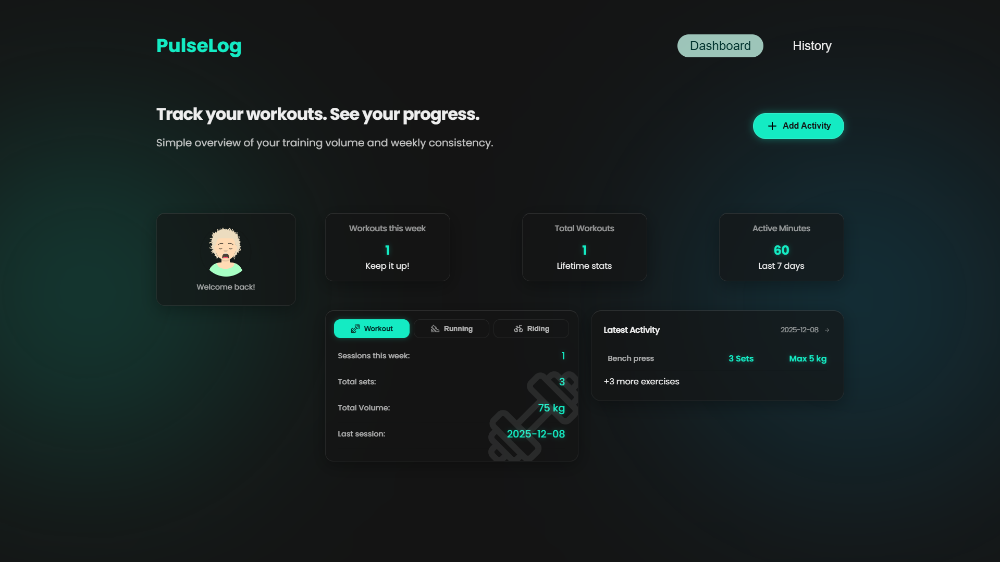

# ⚡️ PulseLog


**A privacy-first, aesthetic workout tracker built for hybrid athletes.**

> 🚀 **Live Demo:** https://pulselog-gray.vercel.app/

PulseLog bridges the gap between **high-fidelity UX design** and **robust frontend engineering**. It allows users to track hybrid training routines—from complex gym sessions to cardio activities—with a focus on speed, aesthetics, and offline capability.

---

## 📸 Interface



---

## 🎯 The Mission: Design Engineering

As a **Design Engineer**, my goal was to build a product that feels as good as it looks. I wanted to move beyond simple tutorial projects and tackle real-world frontend challenges:

* **Complex State Management:** Handling deeply nested data structures (Workouts > Exercises > Sets).
* **Polymorphic Data:** Treating Runs, Rides, and Lifts differently while keeping a unified UI architecture.
* **Design Systems:** Implementing a strict "Dark Mode & Mint" theme using modern CSS variables without external UI libraries.

---

## ✨ Key Features

* **📊 Smart Dashboard:** Visualizes weekly progress, active minutes, and recent volume at a glance using aggregated data.
* **📝 Polymorphic Input System:** Context-aware forms that adapt UI based on activity type (e.g., "Distance/Pace" for runs vs. "Sets/Reps" for lifting).
* **💾 Offline-First:** Uses LocalStorage for instant interaction and zero latency. No login or backend required.
* **📱 Fully Responsive:** Optimized for mobile usage in the gym (thumb-zone navigation), but scales beautifully to desktop via CSS Grid layouts.
* **⚡️ CRUD Operations:** Full capability to create, read, update, and delete complex activity records.

---

## 💡 Technical Highlights

### 1. Immutable State Updates (Nested Data)
One of the biggest challenges was the "Workout Builder". Updating a specific set within a specific exercise required precise immutable state patterns to prevent side effects.

```typescript
// The logic used to update a specific set inside a specific exercise
setExercises(prev => prev.map((exercise, index) => {
    if (index === exerciseIndex) {
        // Create a shallow copy of the exercise and the sets array
        return { 
            ...exercise, 
            sets: exercise.sets.map((s, i) => i === setIndex ? newSet : s) 
        }
    }
    return exercise
}))

---

2. Polymorphic UI Components

The WorkoutSummary and HistoryCard components adapt their render logic based on the activity.type. By using TypeScript Discriminated Unions, the app safely accesses properties like distanceKm only when the type is strictly verified as 'run' or 'ride', preventing runtime errors.

---

3. CSS Architecture (No Frameworks)

Instead of relying on Tailwind or Bootstrap, I built a custom design system using CSS Variables (:root). This ensures consistency in colors (--color-btn, --bg-color) and spacing across the app, making future theming (e.g., Light Mode) trivial.

---

🛠 Tech Stack

Category - Technology
Core - React 18 (Hooks, Functional Components)
Language - TypeScript (Strict Mode)
Build Tool - Vite
Styling - Vanilla CSS3 (Variables, Flexbox, Grid)
Persistence - LocalStorage API
Assets - Custom SVG Components

---

🏃‍♂️ Getting StartedTo run this project locally:

Clone the repository
Bash
git clone [https://github.com/LevinKooss/pulselog.git](https://github.com/LevinKooss/pulselog.git)

Install dependencies
Bash
npm install

Run the development server
Bash
npm run dev

---

🔮 Future Roadmap

[ ] Supabase Integration: Moving from LocalStorage to a cloud DB for cross-device sync.
[ ] Data Visualization: Adding Recharts for graphical progress analysis.
[ ] AI Insights: Implementing an AI coach to suggest weight progression.

Designed & Developed by Levin Kooss